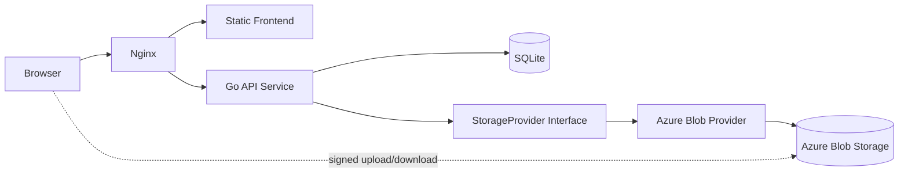

# Detailed System Design

## 1. Purpose

This document turns the approved MVP architecture into a more detailed system design for implementation.

It covers:

- component design
- request flows
- API contracts
- metadata cache behavior
- deployment layout
- Nginx integration
- `systemd` service design
- configuration model
- schema outline
- operational considerations

This document assumes:

- Ubuntu 20.04 host
- about 2 CPU cores and 2 GB RAM
- existing Nginx already in use
- Go backend
- `chi` router
- static frontend served by Nginx
- Azure Blob Storage first
- AWS S3 and Aliyun OSS later
- SQLite for MVP metadata/auth/cache

## 2. System overview

The system is a thin storage gateway.

- Nginx serves static frontend assets and proxies API requests
- the browser calls JSON APIs on the Go service
- the Go service authenticates, validates paths, manages metadata cache, and issues signed URLs
- large file transfers go directly between the browser and object storage
- SQLite stores auth/session/config/cache data

This keeps the Ubuntu host out of the data-transfer hot path.

## 3. Logical component diagram



## 4. Runtime/component responsibilities

### 4.1 Browser

Responsibilities:

- render login, file list, and preview UI
- call JSON APIs
- upload files to signed provider URLs
- download files from signed provider URLs
- display upload progress and request errors

Must not:

- hold storage account secrets
- talk directly to object storage without backend-issued authorization

### 4.2 Nginx

Responsibilities:

- terminate TLS
- serve static frontend assets
- proxy `/api/*` to the Go backend
- attach request IDs if available
- apply basic security headers
- optionally rate-limit auth-sensitive endpoints

### 4.3 Go API service

Responsibilities:

- login/logout/session handling
- path normalization and validation
- browse/list logic
- metadata lookup and caching
- signed upload/download/view URL creation
- provider abstraction
- operational endpoints

Must not:

- act as the default data relay for large objects
- contain provider-specific logic in handlers

### 4.4 SQLite

Responsibilities:

- persistent auth/session state
- configuration values if needed
- file and directory metadata cache
- optional audit/event records

### 4.5 Storage provider layer

Responsibilities:

- translate normalized app operations to provider SDK calls
- generate provider-specific signed URLs
- map object metadata to normalized internal models

## 5. Deployment diagram

```mermaid
flowchart TB
    subgraph Host[Ubuntu Host]
        N[Nginx]
        FE[/var/www/storage-ui]
        APP[storage-api.service]
        BIN[/opt/storage/bin/storage-api]
        ENV[/etc/storage-api/storage-api.env]
        DB[(SQLite DB)]
        CACHE[/var/lib/storage-api/cache]
        LOGS[journald]
    end

    CLOUD[(Azure Blob Storage)]
    USERS[Users]

    USERS --> N
    N --> FE
    N --> APP
    APP --> BIN
    APP --> ENV
    APP --> DB
    APP --> CACHE
    APP --> CLOUD
    APP --> LOGS
    USERS -. signed transfer .-> CLOUD
```

## 6. Main request flows

### 6.1 Login flow

1. Browser submits credentials to `POST /api/login`
2. Go service validates credentials against `users`
3. Go service creates session
4. Session cookie is returned
5. Browser uses cookie on later API requests

### 6.2 Folder listing flow

1. Browser requests `GET /api/list?path=/photos`
2. Go service normalizes `/photos`
3. Go service checks metadata cache
4. If cache hit and fresh, return cached listing
5. If miss/stale, query provider by prefix
6. Normalize provider objects into directory/file entries
7. Update cache
8. Return JSON listing to browser

### 6.3 File metadata flow

1. Browser requests `GET /api/meta?path=/photos/a.jpg`
2. Service checks cache
3. If needed, provider metadata is fetched
4. Normalized metadata is cached
5. JSON response is returned

### 6.4 Upload flow

1. Browser submits `POST /api/upload-url`
2. Service validates target path and policy
3. Service asks provider to create signed upload URL or form
4. Service stores upload record if needed
5. Signed upload instructions are returned
6. Browser uploads file directly to object storage
7. Browser optionally notifies backend of completion
8. Backend invalidates or refreshes relevant directory cache

### 6.5 Download/view flow

1. Browser requests `POST /api/download-url` or `GET /api/preview`
2. Service validates access and path
3. Service generates short-lived signed read URL
4. Browser fetches content directly from provider

## 7. Backend module design

Suggested package layout:

```text
cmd/server
internal/http
internal/http/middleware
internal/service
internal/storage
internal/storage/azure
internal/storage/s3        # later
internal/storage/aliyun    # later
internal/repository
internal/repository/sqlite
internal/auth
internal/config
internal/observability
internal/model
```

### 7.1 HTTP layer

Contains:

- route registration
- request decoding
- response encoding
- auth/session middleware
- request ID and logging middleware
- health/readiness handlers

Recommended routes:

- `/api/login`
- `/api/logout`
- `/api/session`
- `/api/list`
- `/api/meta`
- `/api/upload-url`
- `/api/download-url`
- `/api/preview`
- `/health`
- `/ready`

### 7.2 Service layer

Contains business logic:

- `AuthService`
- `BrowseService`
- `FileService`
- `UploadService`
- `DownloadService`
- `CacheService`

The service layer works only with internal models, repositories, and provider interfaces.

### 7.3 Storage provider interface

Example shape:

```go
type StorageProvider interface {
    List(ctx context.Context, path string, opts ListOptions) (ListResult, error)
    Stat(ctx context.Context, path string) (ObjectInfo, error)
    CreateUploadTarget(ctx context.Context, req UploadRequest) (UploadTarget, error)
    CreateDownloadTarget(ctx context.Context, req DownloadRequest) (DownloadTarget, error)
}
```

Notes:

- keep interface small
- use normalized paths, not Azure-specific names
- hide provider SDK types completely

### 7.4 Repository layer

Example boundaries:

```go
type UserRepository interface {
    GetByUsername(ctx context.Context, username string) (User, error)
}

type SessionRepository interface {
    Create(ctx context.Context, session Session) error
    Get(ctx context.Context, id string) (Session, error)
    Delete(ctx context.Context, id string) error
}

type MetadataRepository interface {
    GetDirectoryCache(ctx context.Context, path string) (DirectoryCacheEntry, error)
    PutDirectoryCache(ctx context.Context, entry DirectoryCacheEntry) error
    GetObjectCache(ctx context.Context, path string) (ObjectCacheEntry, error)
    PutObjectCache(ctx context.Context, entry ObjectCacheEntry) error
    InvalidatePrefix(ctx context.Context, path string) error
}
```

## 8. API contract draft

This is a working contract draft for implementation. Names can still be adjusted, but the shapes should remain stable.

### 8.1 `POST /api/login`

Request:

```json
{
  "username": "admin",
  "password": "secret"
}
```

Response:

```json
{
  "user": {
    "id": "u_1",
    "username": "admin"
  }
}
```

Behavior:

- sets secure session cookie
- returns `401` on invalid credentials

### 8.2 `POST /api/logout`

Response:

```json
{
  "ok": true
}
```

Behavior:

- invalidates session cookie and server session

### 8.3 `GET /api/session`

Response:

```json
{
  "authenticated": true,
  "user": {
    "id": "u_1",
    "username": "admin"
  }
}
```

### 8.4 `GET /api/list?path=/docs&cursor=...&limit=100`

Response:

```json
{
  "path": "/docs",
  "entries": [
    {
      "name": "photos",
      "path": "/docs/photos",
      "type": "directory"
    },
    {
      "name": "a.jpg",
      "path": "/docs/a.jpg",
      "type": "file",
      "size": 12345,
      "mimeType": "image/jpeg",
      "modifiedAt": "2026-03-20T12:00:00Z"
    }
  ],
  "nextCursor": null,
  "source": "cache"
}
```

Notes:

- support pagination even if the first UI does not fully expose it
- `source` helps debugging cache behavior

### 8.5 `GET /api/meta?path=/docs/a.jpg`

Response:

```json
{
  "path": "/docs/a.jpg",
  "type": "file",
  "size": 12345,
  "mimeType": "image/jpeg",
  "modifiedAt": "2026-03-20T12:00:00Z",
  "etag": "abc123",
  "previewable": true
}
```

### 8.6 `POST /api/upload-url`

Request:

```json
{
  "path": "/docs/a.jpg",
  "size": 12345,
  "mimeType": "image/jpeg"
}
```

Response:

```json
{
  "provider": "azure",
  "method": "PUT",
  "url": "https://example.blob.core.windows.net/...",
  "headers": {
    "x-ms-blob-type": "BlockBlob",
    "Content-Type": "image/jpeg"
  },
  "expiresAt": "2026-03-20T12:10:00Z"
}
```

Notes:

- future providers may return different upload instructions
- keep the response generic enough for Azure/S3/OSS

### 8.7 `POST /api/download-url`

Request:

```json
{
  "path": "/docs/a.jpg"
}
```

Response:

```json
{
  "url": "https://example.blob.core.windows.net/...",
  "expiresAt": "2026-03-20T12:10:00Z"
}
```

### 8.8 `GET /api/preview?path=/docs/a.jpg`

Response:

```json
{
  "path": "/docs/a.jpg",
  "mode": "redirect",
  "url": "https://example.blob.core.windows.net/...",
  "expiresAt": "2026-03-20T12:10:00Z"
}
```

Preview policy:

- images: direct signed URL
- pdf/text: signed URL if browser can render directly
- unsupported types: frontend should offer download

### 8.9 `GET /health`

Response:

```json
{
  "ok": true
}
```

### 8.10 `GET /ready`

Response:

```json
{
  "ok": true,
  "checks": {
    "sqlite": "ok",
    "storageProvider": "ok"
  }
}
```

## 9. Error model

Use consistent JSON errors:

```json
{
  "error": {
    "code": "invalid_path",
    "message": "Path is invalid."
  }
}
```

Recommended codes:

- `unauthorized`
- `forbidden`
- `invalid_path`
- `not_found`
- `provider_error`
- `database_error`
- `rate_limited`
- `validation_error`

## 10. Metadata cache design

### 10.1 Goals

- reduce provider round-trips
- improve folder browsing responsiveness
- support pagination and repeated navigation

### 10.2 Cache model

Use SQLite as a persistent metadata cache.

Cache types:

- directory listing cache
- object metadata cache

### 10.3 Freshness strategy

Recommended MVP strategy:

- use TTL-based freshness
- invalidate parent directory cache after successful upload
- invalidate affected path after delete or overwrite
- keep rules simple and explicit

Example defaults:

- directory listing TTL: 30 to 120 seconds
- object metadata TTL: 60 to 300 seconds

These values can be adjusted later based on browsing behavior.

### 10.4 Cache source of truth

- object storage remains the source of truth
- cache is an optimization only
- responses may indicate whether data came from cache or provider

## 11. SQLite schema outline

This is a conceptual schema, not the final migration file.

### 11.1 `users`

```sql
CREATE TABLE users (
  id TEXT PRIMARY KEY,
  username TEXT NOT NULL UNIQUE,
  password_hash TEXT NOT NULL,
  created_at TEXT NOT NULL
);
```

### 11.2 `sessions`

```sql
CREATE TABLE sessions (
  id TEXT PRIMARY KEY,
  user_id TEXT NOT NULL,
  expires_at TEXT NOT NULL,
  created_at TEXT NOT NULL,
  last_seen_at TEXT NOT NULL
);
CREATE INDEX idx_sessions_user_id ON sessions(user_id);
```

### 11.3 `directory_cache`

```sql
CREATE TABLE directory_cache (
  path TEXT PRIMARY KEY,
  payload_json TEXT NOT NULL,
  source_etag TEXT,
  fetched_at TEXT NOT NULL,
  expires_at TEXT NOT NULL
);
```

### 11.4 `object_cache`

```sql
CREATE TABLE object_cache (
  path TEXT PRIMARY KEY,
  type TEXT NOT NULL,
  size_bytes INTEGER,
  mime_type TEXT,
  modified_at TEXT,
  etag TEXT,
  payload_json TEXT NOT NULL,
  fetched_at TEXT NOT NULL,
  expires_at TEXT NOT NULL
);
```

### 11.5 optional `audit_events`

```sql
CREATE TABLE audit_events (
  id TEXT PRIMARY KEY,
  user_id TEXT,
  action TEXT NOT NULL,
  path TEXT,
  metadata_json TEXT,
  created_at TEXT NOT NULL
);
```

## 12. Frontend design detail

### 12.1 Frontend structure

Suggested structure:

```text
frontend/
  index.html
  login.html
  app.js
  api.js
  auth.js
  browser.js
  upload.js
  styles.css
```

If a small build tool is used, keep output minimal and static.

### 12.2 Frontend state

Keep state shallow:

- current path
- current listing
- current selected file
- upload state
- session state

Avoid heavyweight client state tooling in MVP.

### 12.3 React compatibility

To preserve a future React path:

- keep all business logic server-side
- keep frontend/backend interaction JSON-based
- avoid HTML-fragment-only contracts
- use versioned API routes later if needed

## 13. Nginx design

### 13.1 Routing model

Suggested:

- `/` and static assets -> frontend directory
- `/api/` -> Go backend

### 13.2 Example Nginx server block fragment

```nginx
server {
    listen 443 ssl http2;
    server_name storage.example.com;

    root /var/www/storage-ui;
    index index.html;

    add_header X-Content-Type-Options nosniff always;
    add_header X-Frame-Options SAMEORIGIN always;
    add_header Referrer-Policy no-referrer-when-downgrade always;

    location / {
        try_files $uri $uri/ /index.html;
    }

    location /api/ {
        proxy_pass http://127.0.0.1:8081;
        proxy_http_version 1.1;
        proxy_set_header Host $host;
        proxy_set_header X-Real-IP $remote_addr;
        proxy_set_header X-Forwarded-For $proxy_add_x_forwarded_for;
        proxy_set_header X-Forwarded-Proto $scheme;
        proxy_set_header X-Request-ID $request_id;
    }

    location = /healthz-nginx {
        return 200 "ok\n";
    }
}
```

Notes:

- adjust root/server name to fit your environment
- if SPA routing is not needed, `try_files` can be simplified

## 14. `systemd` service design

### 14.1 Unit strategy

Use one service unit for the Go API process:

- binary installed in `/opt/storage/bin/storage-api`
- environment file in `/etc/storage-api/storage-api.env`
- runtime user `storage-api`
- working directory `/opt/storage`

### 14.2 Example unit file

Path:

```text
/etc/systemd/system/storage-api.service
```

Contents:

```ini
[Unit]
Description=Storage API service
After=network-online.target
Wants=network-online.target

[Service]
Type=simple
User=storage-api
Group=storage-api
WorkingDirectory=/opt/storage
EnvironmentFile=/etc/storage-api/storage-api.env
ExecStart=/opt/storage/bin/storage-api
Restart=on-failure
RestartSec=3

# Journald logging
StandardOutput=journal
StandardError=journal

# Basic hardening
NoNewPrivileges=true
PrivateTmp=true
ProtectSystem=full
ProtectHome=true
ReadWritePaths=/var/lib/storage-api /var/cache/storage-api
LimitNOFILE=65535

[Install]
WantedBy=multi-user.target
```

### 14.3 Suggested directories

```text
/opt/storage/bin/storage-api
/etc/storage-api/storage-api.env
/var/lib/storage-api/storage.db
/var/cache/storage-api/
/var/www/storage-ui/
```

### 14.4 Operational commands

```bash
sudo systemctl daemon-reload
sudo systemctl enable storage-api
sudo systemctl start storage-api
sudo systemctl status storage-api
sudo journalctl -u storage-api -f
```

### 14.5 Restart behavior

Recommended:

- `Restart=on-failure`
- short backoff
- do not use overly aggressive restart loops

### 14.6 Security notes for `systemd`

- run as non-root
- keep credentials in the environment file with restricted permissions
- consider moving secrets to a safer secret-loading model later
- restrict writable paths

## 15. Configuration model

Recommended environment variables:

```text
APP_ENV=production
APP_ADDR=127.0.0.1:8081
APP_BASE_URL=https://storage.example.com
SESSION_COOKIE_NAME=storage_session
SESSION_COOKIE_SECURE=true
SESSION_TTL_HOURS=168

SQLITE_PATH=/var/lib/storage-api/storage.db
METADATA_CACHE_DIR_TTL_SECONDS=60
METADATA_CACHE_OBJECT_TTL_SECONDS=120

STORAGE_PROVIDER=azure
AZURE_STORAGE_ACCOUNT=...
AZURE_STORAGE_CONTAINER=...
AZURE_STORAGE_KEY=...
SIGNED_URL_TTL_SECONDS=300

LOG_LEVEL=info
```

Notes:

- keep provider-specific configuration grouped
- later providers should use parallel variable names
- do not expose provider credentials to the frontend

## 16. Observability and operations

### 16.1 Logs

Use structured logs with at least:

- timestamp
- level
- request ID
- user ID if authenticated
- path
- operation name
- duration
- status/result

### 16.2 Metrics

MVP may skip a full metrics stack, but should at least make future instrumentation easy.

Priority measurements:

- request counts
- request latency
- provider latency
- cache hit rate
- upload URL generation failures
- SQLite failures

### 16.3 Health checks

- `/health` should confirm the process is running
- `/ready` should confirm SQLite open + provider config usable

## 17. Performance considerations

Given the host limits, optimize for:

- direct browser-to-provider transfers
- low allocation API handlers
- small JSON responses
- metadata cache effectiveness
- bounded listing page sizes

Recommended defaults:

- list page size: 100
- max page size: 500
- upload URL expiry: 5 minutes
- download URL expiry: 5 minutes

## 18. Security considerations

- secure cookies
- CSRF protection if cookie-authenticated browser POSTs are used
- strict path normalization
- rate-limit login attempts
- short-lived signed URLs
- no provider secrets in frontend
- audit sensitive operations later if needed

## 19. Thumbnail strategy

Do not require thumbnails in the first implementation.

If added later:

- generate on demand
- cache generated thumbnails
- use LRU eviction if local cache is used
- consider storing thumbnails in object storage instead of regenerating frequently

## 20. Future extension points

- S3 provider
- Aliyun OSS provider
- stronger DB backend
- React frontend
- resumable multipart upload flows
- audit logging expansion
- background jobs for thumbnails or cleanup

## 21. Implementation order

Recommended build order:

1. config loading
2. SQLite repositories
3. auth/session flow
4. Azure provider
5. list/meta APIs
6. upload/download signed URL APIs
7. static frontend integration
8. Nginx wiring
9. `systemd` deployment
10. cache tuning and health checks

## 22. Open questions

Items to confirm before implementation:

1. single-user only, or small multi-user?
2. preferred subdomain/path under the existing Nginx host?
3. overwrite policy on upload?
4. delete support in MVP or later?
5. whether audit events should be included from the first implementation?
